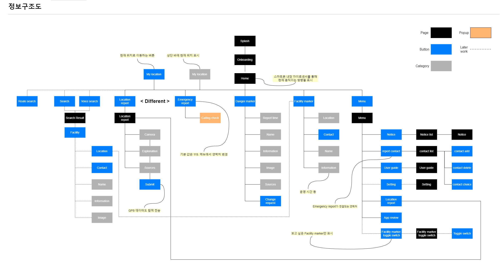
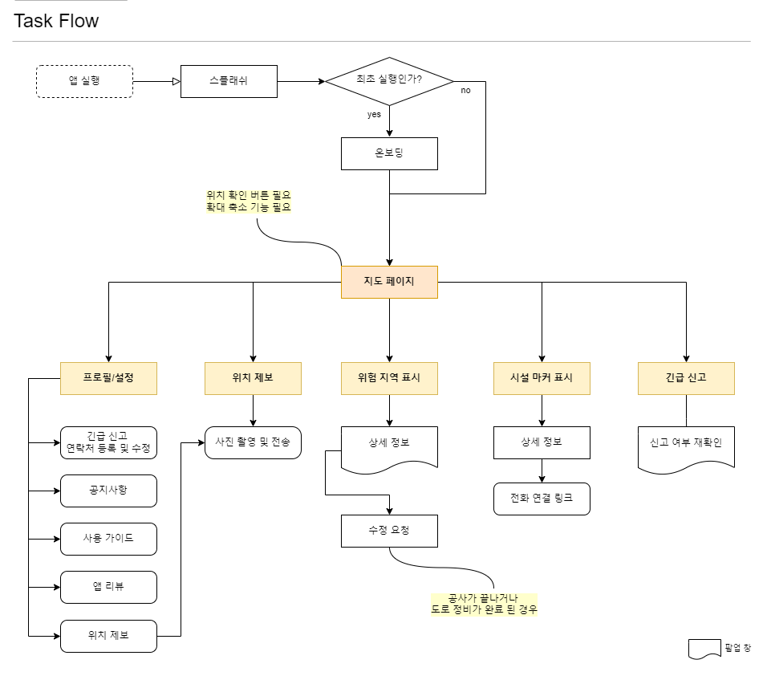
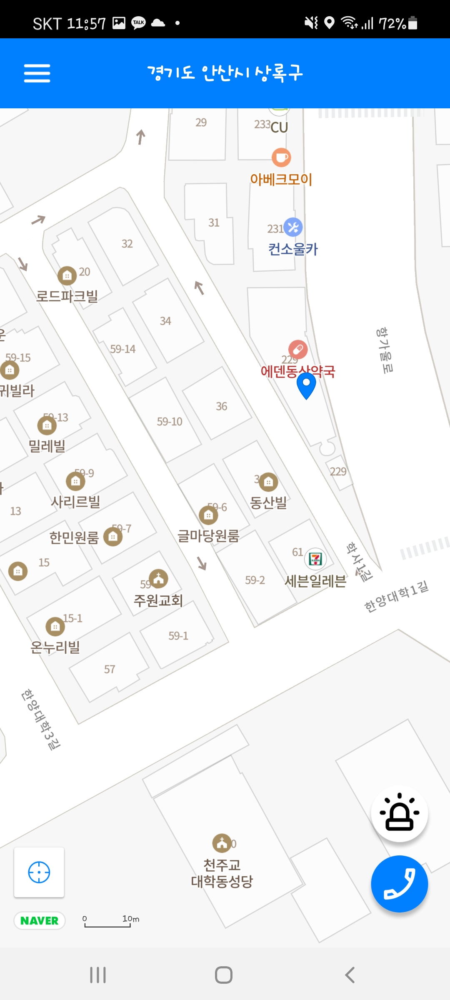
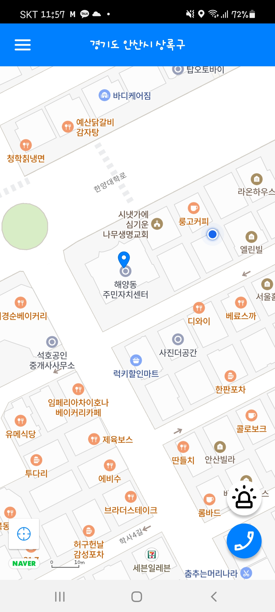
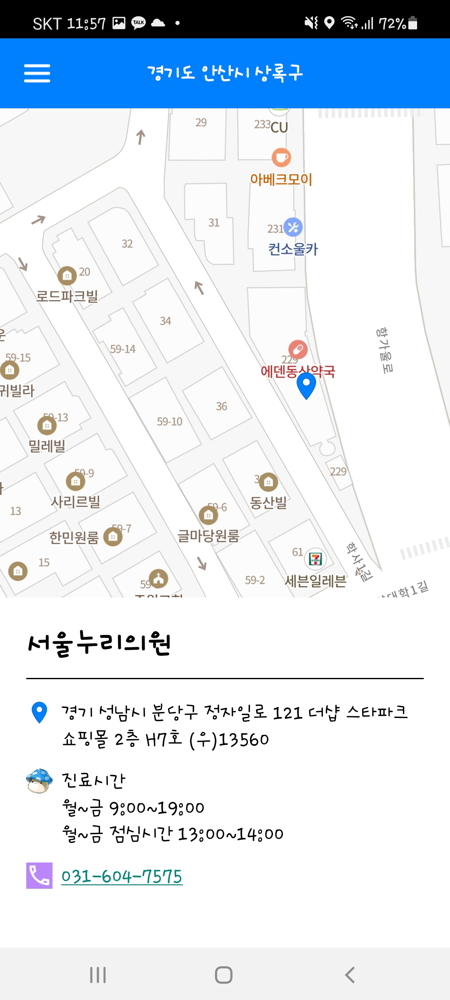
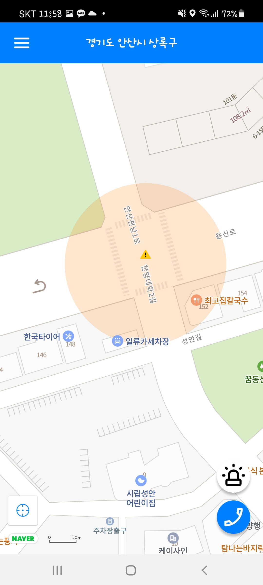

# UMC_Hackathon
2nd UMC Hackathon 7/1 ~ 7/2 진행

### [TEAM INFO]
#### Name
- 34번 | 어빌리티맵
   
#### Member
> App (Android)
- 임재완(PM)  [@jaewan0114](https://github.com/jaewan0114)
- 오상희 [@sh-532](https://github.com/sh-532)     
- 정현규 [@hkjeong2](https://github.com/hkjeong2)   

> Server (Node.js)
- 서위영 [@HBSPS](https://github.com/HBSPS)   
- 윤진난 [@Jinnan-Yun](https://github.com/Jinnan-Yun)   
- 곽정아 [@JungAh](https://github.com/Jungahgo)   
   
> Designer 
- 정민희

#### 참고사항
- contributor : 곽정아, 정현규는 2일 중 1일 참여하였고 파일을 팀원들이 이어받아 작업하였습니다.   
- 작업 : 실행화면 / 데이터 / 마커 / 메인지도
   
------------- 
### [아이디어 소개]   

#### 어빌리티 맵
편의시설과 위험지역에 대한 정보 제공으로  **교통약자의 안전과 이동편의 증진**  
> _#편의증진_ _#교통약자_ _#사회적가치_ _#사회적문제해결_ _#지도_

#### Information Architecture.  
   

#### Flow Chart
 
   
#### 구현 기능
1. 주변 복지센터, 병원, 관공서(행정) 안내


2. 상세 주소 확인

3. 수집한 위험 지역 주의 표시



## Request

### Header

| Name | Type | Example | Nullable | Description | Default |
| --- | --- | --- | --- | --- | --- |
|  |  |  |  |  |  |

### Query String

| Name | Type | Example | Nullable | Description | Default |
| --- | --- | --- | --- | --- | --- |
|  |  |  |  |  |  |

### Body

| Name | Type | Example | Nullable | Description | Default |
| --- | --- | --- | --- | --- | --- |
|  |  |  |  |  |  |

## Response

| Name | Type | Example | Nullable | Description |
| --- | --- | --- | --- | --- |
| isSuccess | boolean | true | N |  |
| code | int | 1000 | N |  |
| message | string | 성공 | N |  |
| result | object |  | Y |  |
| ㄴname | varchar(50) | 유앤아이 피부과의원 왕십리점 |  | 장소 이름 |
| ㄴlat | double | 37.5617465 |  | 위도 |
| ㄴlon | double | 127.0342572 |  | 경도 |
| ㄴtel | varchar(15) | 02-2275-6020 |  | 전화번호 |
| ㄴloacation | varchar(20) | 2, 3층 |  | 상세 주소 |
| ㄴweek | varchar(50) | 10:00 - 20:30 / 13:00 - 14:00 점심시간 |  | 주중 영업 시간 |
| ㄴweekend | varchar(50) | 토 10:00 - 17:00 |  | 주말 영업 시간 |
| ㄴholiday | varchar(30) | 일 정기휴무 |  | 공휴일 영업 시간 |
| ㄴvar | varvhar(1) | X |  | 주중 또는 주말에 특별히 다른 시간에 운영 되는지 여부 |

### Status Code

| Code | Message |
| --- | --- |
| 1000 | SUCCESS, 성공 |
| 4000 | DB_ERROR, 데이터 베이스 에러 |
| 4001 | SERVER_ERROR, 서버 에러 |

### URL: http://3.35.237.29/total
### Example
```json
{
"isSuccess": true,
"code": 1000,
"message": "성공",
"result": [
	{
		"name": "한양대학교 병원",
		"lat": 37.5596569,
		"lon": 127.0441339,
		"tel": "02-2290-8114",
		"location": "",
		"week": "08:30 - 17:30",
		"weekend": "휴무 응급센터 종일진료",
		"holiday": "휴무 응급센터 종일진료",
		"var": "X"
	},
	{
		"name": "유앤아이 피부과의원 왕십리점",
		"lat": 37.5617465,
		"lon": 127.0342572,
		"tel": "02-2275-6020",
		"location": "2, 3층",
		"week": "10:00 - 20:30 / 13:00 - 14:00 점심시간",
		"weekend": "토 10:00 - 17:00",
		"holiday": "일 정기휴무",
		"var": "X"
	}
```

- 네이버 맵 API르 이용하여 지도 표시 : 메인지도
- 네이버 플레이스에서 검색으로 기관명, 주소 크롤링 : 데이터
- 장소 마커 표시 : 마커
- 위험 지역 ; 데이터
- 어빌리티 앱 IA, Flow-Chart
- Splash, Icon 제작 

     

